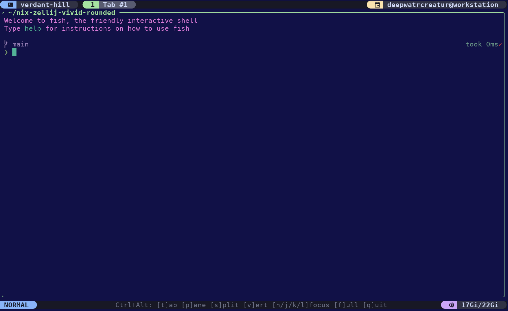

# nix-zellij-vivid-rounded

A highly customized [Zellij](https://zellij.dev/) configuration for NixOS/home-manager featuring vivid colors, rounded tab indicators, and thoughtfully remapped keybindings.

## Features

### Visual Design
- **Vivid color palette**: Bright, saturated Catppuccin Mocha theme with:
  - Light green active tabs (`#a6e3a1`)
  - Light blue status bars (`#89B4FA`)
  - Vibrant accent colors across all modes (orange, purple, cyan, yellow)
- **Rounded tab indicators**: Pill-shaped active tabs with smooth visual separation
- **Custom layout**: Top status bar showing session name and tabs, bottom guide bar with keybinding reminders
- **Git branch display**: Shows current branch in bottom right

### Clipboard & Text Selection
- **Automatic copy-to-clipboard**: Text selection automatically copies to system clipboard
- Works locally and over SSH (uses system clipboard backend)

### Keybindings - Designed for Terminal Tool Compatibility
All Zellij control keybindings use **Ctrl+Alt** modifier instead of raw Ctrl to avoid conflicts with TUI applications like coding agents, text editors, and interactive CLI tools.

#### Tab Management (Ctrl+Alt)
- `Ctrl+Alt+t` - Enter tab mode
- `Ctrl+Alt+c` - Create new tab
- `Ctrl+Alt+x` - Close current tab
- `Ctrl+Alt+[` / `Ctrl+Alt+]` - Previous/next tab
- `Ctrl+Alt+1-9` - Go to specific tab

#### Pane Management (Ctrl+Alt)
- `Ctrl+Alt+p` - Enter pane mode
- `Ctrl+Alt+s` - Split down (new pane below)
- `Ctrl+Alt+v` - Split right (new pane to the right)
- `Ctrl+Alt+h/j/k/l` - Move focus left/down/up/right (vim-style)

#### Pane Focus & Navigation (Ctrl+Alt)
- `Ctrl+Alt+f` / `Ctrl+Alt+z` - Toggle focused pane fullscreen (maximizes current pane)
- `Ctrl+Alt+q` - Quit Zellij

#### Modal Commands (vim-style)
Once you enter a mode with Ctrl+Alt+t (tab) or Ctrl+Alt+p (pane):

**Tab Mode** (after Ctrl+Alt+t):
- `h` / `l` - Previous/next tab
- `1-9` - Go to specific tab
- `c` - Create new tab
- `x` - Close current tab
- `r` - Rename tab
- `s` - Enter session mode
- `Esc` - Return to normal mode

**Pane Mode** (after Ctrl+Alt+p):
- `h/j/k/l` - Move focus left/down/up/right
- `p` - New pane to the left
- `n` - New pane below
- `x` - Close focused pane
- `f` / `z` - Toggle pane fullscreen
- `Esc` - Return to normal mode

## Installation

### With home-manager
Add to your `flake.nix`:

```nix
{
  inputs = {
    nixpkgs.url = "github:nixos/nixpkgs/nixos-unstable";
    home-manager.url = "github:nix-community/home-manager";
    zellij-vivid-rounded.url = "github:deepwatrcreatur/nix-zellij-vivid-rounded";
  };

  outputs = { home-manager, zellij-vivid-rounded, ... }@inputs:
    {
      homeConfigurations.yourusername = home-manager.lib.homeManagerConfiguration {
        modules = [
          zellij-vivid-rounded.homeManagerModules.default
          # ... other modules
        ];
      };
    };
}
```

Then enable in your home-manager configuration:

```nix
programs.zellij-vivid-rounded.enable = true;
```

## Why Ctrl+Alt for Keybindings?

Standard Zellij uses raw Ctrl keybindings (Ctrl+p, Ctrl+t, etc.) which conflict with interactive terminal tools like:
- Claude Code and other coding agents (Ctrl+p for command palettes)
- Editors (Ctrl+s for save, Ctrl+t for new tab)
- TUI applications (vim, emacs, htop, etc.)

By using **Ctrl+Alt** instead, we free up raw Ctrl entirely for these applications while maintaining intuitive zellij control.

## About "Pane Fullscreen"

The `[f]ull` hint in the bottom status bar refers to **pane focus fullscreen**, not terminal fullscreen:
- `Ctrl+Alt+f` or `Ctrl+Alt+z` maximizes the currently focused pane to fill the window
- This hides other panes temporarily for a focused editing session
- Press again to restore the pane layout
- When in pane mode (`Ctrl+Alt+p`), you can also use `f` or `z` to toggle

This is different from traditional terminal fullscreen (F11) which would maximize the Zellij window itself.

## Customization

The module respects home-manager conventions. You can:
- Override the theme by modifying `config.programs.zellij.settings.themes`
- Add additional keybindings via `config.programs.zellij.settings.keybinds`
- Modify the layout by editing the KDL in `xdg.configFile."zellij/layouts/extended.kdl"`

## Screenshot



The screenshot shows:
- Light blue (`#89B4FA`) top and bottom bars
- Light green (`#a6e3a1`) active tab highlight
- Vim-style keybinding hints in the status bar with colored boxes by category
- Multiple tabs with pill-shaped backgrounds
- System info in top-right: OS symbol + user@host + memory usage

### Current State (Recent Updates)

✅ **Fixed:**
- Ctrl+Alt modifier shown in status bar
- User@host correctly displayed in top-right corner
- Bottom status bar with colored boxes organizing keybinding hints
- Clipboard auto-copy on text selection
- Rounded pane frame corners (ui.pane_frames.rounded_corners)
- **Tab pill-shape styling restored** - Using background color block approach for true rounded visual effect
- **Top-right system info box** - Added pill-shaped styling with light blue background
- **Bottom-right git branch** - Added pill-shaped styling with purple background

All visual polish elements now complete - tabs, mode indicators, and status displays have proper rounded pill shapes using background color contrast effects (matching the original design approach).

## Integration with Your Multi-Host Setup

Use in your unified-nix-configuration:

```nix
{
  inputs = {
    zellij-vivid-rounded.url = "github:deepwatrcreatur/nix-zellij-vivid-rounded";
  };

  outputs = { zellij-vivid-rounded, ... }@inputs:
    {
      homeConfigurations.hostname = home-manager.lib.homeManagerConfiguration {
        modules = [
          zellij-vivid-rounded.homeManagerModules.default
          # ... your other modules
        ];
      };
    };
}
```

## License

MIT
